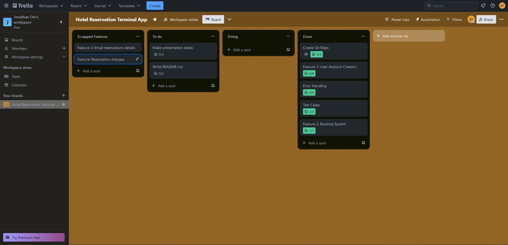

# T1A3 Terminal Application 
## Jonathan Ow

[Github repository](https://github.com/Xphalagas/Terminal-App-Hotel-Reservation-System)

[Trello Board](https://trello.com/b/KJVgGyet/hotel-reservation-terminal-app)

### Purpose and Key Features

This terminal application is designed to simulated the process of reserving a hotel room. By using a variety of functions, this application asks and stores information from the user regarding the details of their stay including room type

### Feature 1: Register Account

In order to begin the reservation process, users must first create an account using the register function. The function takes 2 inputs, username and password which are then stored in the database.txt file. The split method is used to separate both inputs so that they can be accessed later. For security purposes, all passwords must be at least 6 characters long and an if statement ensures that if input does not match the requirements the user will be taken back to the Home function to restart the process. If the username the user has inputted already exists in the database, a prompt will appear telling the user and the process will restart. If both username and password meet the requirements, they will be appended to the database.txt file and the username will be appended to the user universal variable to be printed out at the end of the reservation process.


### Feature 2: Access Account

If the user has created an account in the past, they are able to re-access it by using the access function. This function accepts 2 inputs, one for username and one for password. The function will then search the database file and check whether or not the username exists and if the password that has been entered matches it. If not, the error handling statements account for all potential scenarios where either username or password is incorrect and will then prompt the user to either create an account or try again. I have chosen to separate this from the account creation function as it keep the overall code DRY and ensures separation of concerns is maintained


### Feature 3: Room Selection 

Once the program has confirmed the user has entered correct login details, the function room select will be called. The function displays the list of rooms that are available to be reserved by the user including their type and price per night. The user then is asked to input the corresponding number which will select the desired room. Once selected the program will append the room type to the variable room and the cost to the variable. Each condition statement will handle each input as well as incorrect inputs which will ask the user to re-enter a correct number. 


### Feature 4: Calendar Display

To assist the user with selecting their reservation dates, I decided to utilise the calendar module which outputs a calendar of the user's choice. The function takes in 2 inputs, a year and month. The main part of the function is the error handling which ensures that the year selected user from the current year onwards and that the month input is between1 (January) and 12 (December) If an incorrect value is entered the function will tell the user. Because this function is not an essential component of the reservation system, the user has the option to skip straight to the check-in function by entering 0 in the terminal. 


### Feature 5: Date Selection (Check-in and Check-out)

Using the imported datetime python module, I have implemented it in these two functions as it ensures that hard coding does not need to be done in order to specify length of years, month and days as the module already accounts for that. This ensures that the code block is optimised and does not require so many conditional statements. How the check in function specifically works goes as follows: It takes in the user input and maps to the year, month and day variable which is splits each by using the (-) These value are assigned to a new variable called checkin-date and is converted to datetime via calling the module. Datetime is also assigned to the today module, and this is used to ensure that the check-in date entered is not a past date and compares it to the user inputted date. If the format does not match, this will trigger the Value Error exception and ask the user to re-enter the desired date. 


### Feature 6: Pin and Room number generator 

As with most hotel rooms, a room number is usually assigned as well as a pin number. The pin and room number generator functions simulate this reality and make use of the random python module to create a random pin that is outputted at the end. 


### Final Output:


Receipt function outputs the reservation details that have been appended to the following variables

### Plan 

I utilised Trello to organise and plan my terminal program spliting tasks into to do, doing and done respectively. I also added checklists on each tab to track progress

Progress Screenshots: 





### Style Guide

This application in Python follows the PEP8 Style Guide (van Rossum, Warsaw and Coghlan, 2023). This includes, but isn't limited to, the following guidelines:
* 4 spaces per indentation level
* Maximum line length is 79 characters
* Imports on separate lines
* Using single-quoted strings consistently, except when an apostrophe appears in the string, in which case double-quotes were used to avoid backslashes, and hence improve readability
* Comments in complete sentences and the first word is capitalised. Also inline comments were avoided
* Function names are in lower case and words are separated by underscores to improve readability.

### Bash Script

```
#!/bin/bash
cd ./src
if [[ -x '$(command -v python)' ]]
then
    pyv='$(python -V 2>&1)'
    if [[ $pyv == 'Python 3'* ]]
    then
        python3 -m venv .venv 
        source .venv/bin/activate
        pip3 install -r ./requirements.txt
        python3 main.py
    else
        echo 'Please update your version of Python.' >&2
    fi 
else
    echo 'Error: 
    This program runs on Python, but it looks like Python is not installed.
    To install Python, check out https://installpython3.com/' >&2
  exit 1
fi

```

### Imported Packages and Modules

* random
* datetime
* calendar
* unittest
